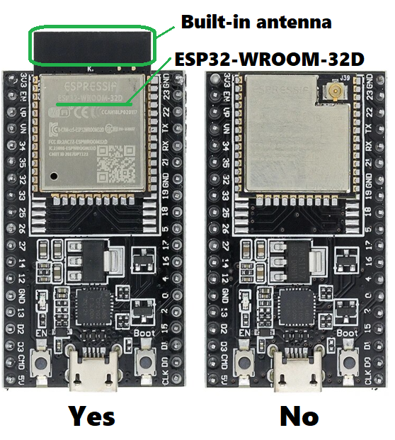
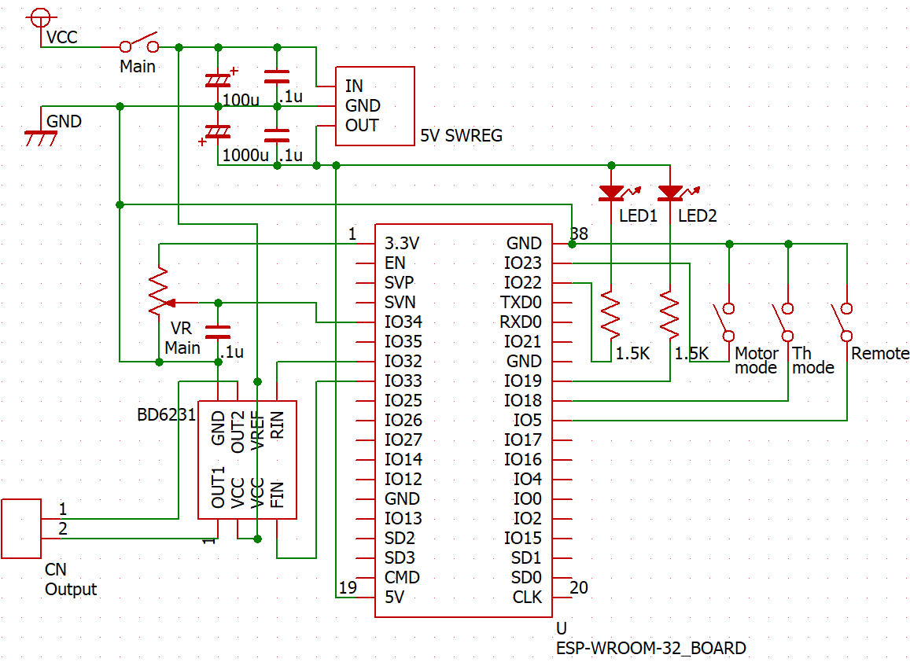

# Wireless_Controller

-Selfmade model railload wireless controller-

<ol>
<li>Introduction 
   This is microprocessor ESP32 based model railload wireless controller.  
   ESP32 is a microprocessor developed by Espressif Systems, with built-in Wi-Fi and Bluetooth, low cost, low power consumption, and other features.
   Although there are many variations of the ESP32, we recommend using a development board that uses the ESP-WROOM-32D (e.g. ESP32-DevKitC-32D).
   The ESP32-DevKitC-32D can be purchased on Ebay, Aliexpress, etc. starting at $4. At this time, purchase one with a built-in antenna (Fig. 1). 
    
    Fig.1  
  This controller are build by Parant unit and Child unit. Both unit includes ESP32 and are connected by Wifi. So to program Parent unit and Child unit, you have to prepare Arduino development enviloment and add esp32 configration. 
    
   The photo below shows the finished product.
   Two pairs of units are being created. One uses an old TOMIX controller as a case for the parent unit, and the other uses an old KATO case.
   Both of the child units are small plastic cases with mobile batteries strapped to them with rubber bands with Velcro.
    
 
    
<li>Parent Unit 
   Parent unit is build by ESP32 and moterdriver mainly. 
   This is Parent unit schematic. 
    
   The roles of each component are as follows
   <ul>
   <li>Main switch (SW Main): Switch for the power supply of the entire controller
   <li>5V Switching Regulator (5V SWREG): Supplies power to the ESP32 board, preferably with an output of 5V 1A or higher.
   <li>Motor Mode switch (Motor Mode): Switches motor driver control between On-Brake and On-Free. On-Brake seems to provide better controllability at lower speeds for coreless motors.
   <li>Throttle mode switch (Th Mode): Reduces the change in power output when the throttle is not opened very much. For coreless motors, it is recommended to set this switch to On.
   <li>Remote switch (Remote): Turns on/off wireless remote control.
   <li>Main volume (VR Main): Used to run the train when the remote mode is turned off. The position when the power is turned on is the midpoint, from which the train runs back and forth by turning it left or right. For this purpose, a potentiometer with a midpoint click should be used.
   <li>Motor driver BD6231: BD6231 is a 1A output motor driver. When using other motor drivers, use those that support PWM input. Also, the BD6231 has automatic output protection at 1.3A. Other motor drivers may not have such a function, so take appropriate output protection measures.
   <li>LED1, LED2: Indicators for running direction.
   </ul>
   
   Parent Unit's program is wpower_p.ino, you should modify Wifi-SSID and password at wpowerp.ino. 

<li>Child Unit
   
</ol>
